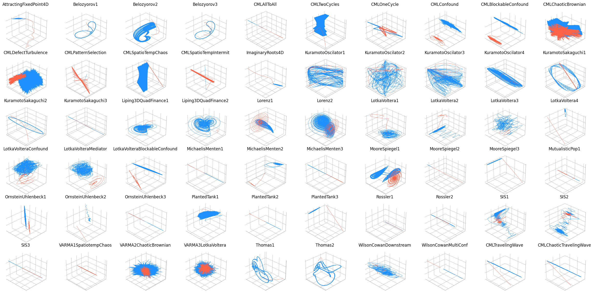
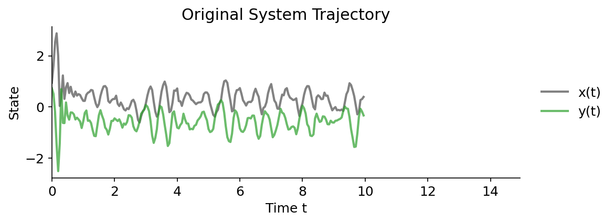
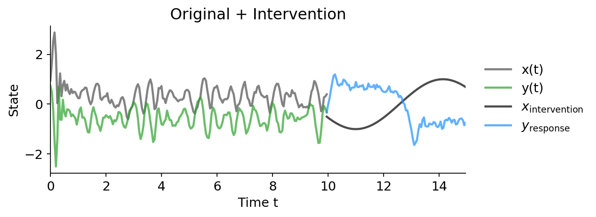
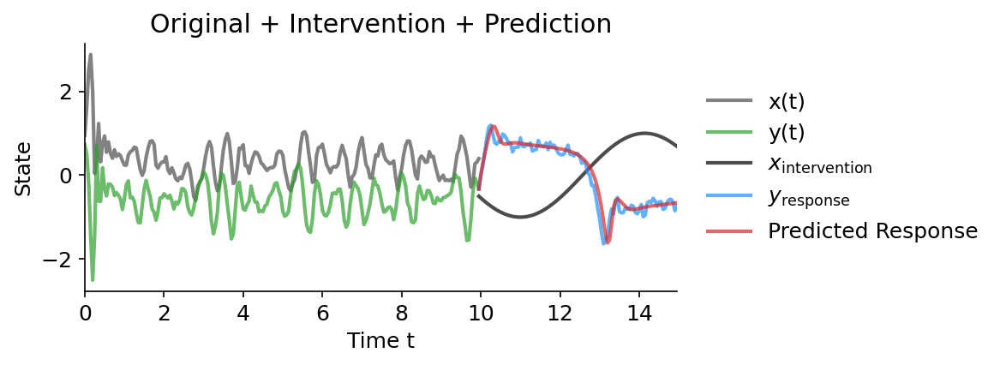

# 🌀 Interfere: Intervention Response Prediction in Complex Dynamic Models
[](https://pypi.org/project/interfere/) [](LICENSE)

Interfere is a comprehensive Python toolkit for simulating, intervening on, and
optimizing forecasting methods to predict the behavior complex dynamical systems. It enables:

- Rich collections of continuous and discrete-time dynamic models (ODEs, SDEs,
  differnce equations, and more).
- Exogenous interventions to generate control and treatment scenarios at scale.
- Seamless forecasting integrations (SINDy, VAR, reservoir computing, ARIMA, LSTM, NHITS).
- Automated sliding-window cross-validation and hyperparameter tuning with Optuna.
- Unified error metrics and evaluation workflows for intervention-response
  prediction.

## Interfere Benchmark Dataset ([Download](https://drive.google.com/file/d/19_Ha-D8Kb1fFJ_iECU62eawbeuCpeV_g/view?usp=sharing))



The image above depicts the uninterrupted trajectories of sixty dynamic models
in blue and their response to a particular intervention in red. This data is
available for download as the [Interfere Benchmark
1.1.1](https://drive.google.com/file/d/19_Ha-D8Kb1fFJ_iECU62eawbeuCpeV_g/view?usp=sharing).
It can be used to benchmark a forecasting method's ability to predict the
response of a dynamic system to interventions.

## Installation

Install the core package from PyPI:

```bash
pip install interfere
```

For Nixtla-based forecasting methods (`ARIMA`, `LSTM`, `NHITS`), install the extras:

```bash
pip install interfere[nixtla]
```

## Quick Start

The Interfere package is designed around three main tasks: counterfactual simulation, predictive method optimization, and prediction. Here's a complete example using the SINDy (Sparse Identification of Nonlinear Dynamics) method:

### 1. Counterfactual Simulation

First, let's create and simulate a dynamic model:

```python
import numpy as np
import interfere
import optuna

# Set up simulation parameters
initial_cond = np.random.rand(3)
t_train = np.arange(0, 10, 0.05)
dynamics = interfere.dynamics.Belozyorov3DQuad(sigma=0.5)

# Generate trajectory
sim_states = dynamics.simulate(t_train, initial_cond)
```



### 2. Applying an Intervention

Next, we'll apply an intervention to one component of the system:

```python
# Time points for the intervention simulation
test_t = np.arange(t_train[-1], 15, 0.05)

# Intervention initialization
intervention = interfere.SignalIntervention(iv_idxs=1, signals=np.sin)

# Simulate intervention
interv_states = dynamics.simulate(
    test_t,
    prior_states=sim_states,
    intervention=intervention,
)
```



### 3. Model Optimization and Prediction

Using the generated data, we can run hyperparameter optimization with a
forecasting method. All forecasting methods come with reasonable hyperparameter
ranges built in.

```python
# Select the SINDy method for hyperparameter optimization.
method_type = interfere.SINDy

# Create an objective function that aims to minimize cross validation error
# over different hyper parameter configurations for SINDy
cv_obj = interfere.CrossValObjective(
    method_type=method_type,
    data=sim_states,
    times=t_train,
    train_window_percent=0.3,
    num_folds=5,
    exog_idxs=intervention.iv_idxs,
)

# Run the study using optuna.
study = optuna.create_study()
study.optimize(cv_obj, n_trials=25)

# Collect the best hyperparameters into a dictionary.
best_param_dict = study.best_params
```

### 4. Intervention Response Prediction

Using the best parameters found, we can fit the forecasting method to
pre-intervention data and then make a prediction about how the system will
respond to the intervention.

```python
# Initialize SINDy with the best perfoming parameters.
method = interfere.SINDy(**study.best_params)

# Use an intervention helper function to split the pre-intervention data
# into endogenous and exogenous columns.
Y_endog, Y_exog = intervention.split_exog(sim_states)

# Fit SINDy to the pre-intervention data.
method.fit(t_train, Y_endog, Y_exog)

# Use the inherited interfere.ForecastingMethod.simulate() method
# To simulate intervention response using SINDy
pred_traj = method.simulate(
    test_t, prior_states=sim_states, intervention=intervention
)
```



The SINDy method identifies the underlying dynamics of the system using sparse regression techniques, making it particularly effective for discovering interpretable mathematical models of complex systems.

## Documentation

- [Simulation](simulation.md): Simulation engines and available dynamic models.
- [Intervention](intervention.md): Exogenous intervention interfaces.
- [Optimization](optimization.md): Automated cross-validation and hyperparameter tuning.
- [Prediction](prediction.md): Counterfactual forecasting workflows.
