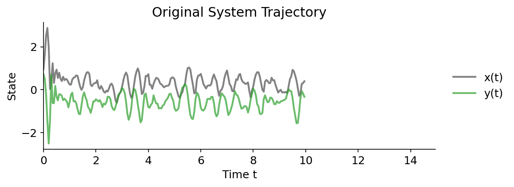
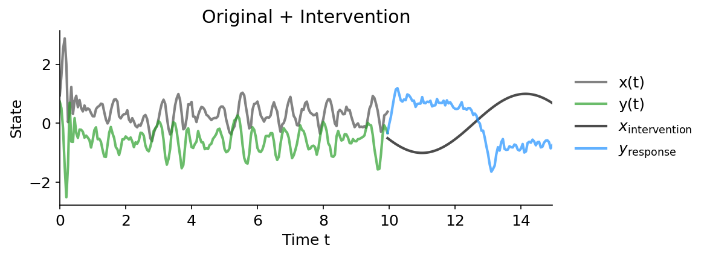
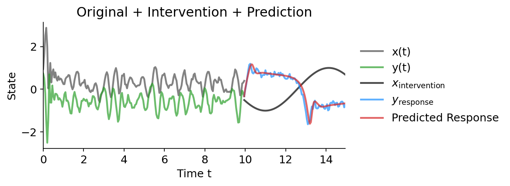

# 🌀 Interfere: Intervention Response Prediction in Complex Dynamic Models

[](https://pypi.org/project/interfere/) [](https://opensource.org/licenses/MIT) [](https://djpasseyjr.github.io/interfere/)

Interfere is a comprehensive Python toolkit for simulating, intervening on, and
optimizing forecasting methods to predict the behavior of complex dynamical systems. It enables:

- Rich collections of continuous and discrete-time dynamic models (ODEs, SDEs,
  difference equations, and more).
- Exogenous interventions to generate control and treatment scenarios at scale.
- Seamless forecasting integrations (SINDy, VAR, reservoir computing, ARIMA, LSTM, NHITS).
- Automated sliding-window cross-validation and hyperparameter tuning with Optuna.
- Unified error metrics and evaluation workflows for intervention-response
  prediction.

## Overview

Interfere is a research-oriented Python package that addresses a fundamental question in complex systems: *When can we predict how complex systems will respond to interventions?* This package provides tools for:

- Modeling dynamic nonlinear multivariate stochastic systems.
- Simulating and analyzing how such systems respond to interventions.
- Generating complex dynamic counterfactuals.
- Studying causal relationships in complex systems.

## Interfere Benchmark Dataset ([Download](https://drive.google.com/file/d/19_Ha-D8Kb1fFJ_iECU62eawbeuCpeV_g/view?usp=sharing))


The image above depicts the uninterrupted trajectories of sixty dynamic models
in blue and their response to a particular intervention in red. This data is
available for download as the [Interfere Benchmark
1.1.1](https://drive.google.com/file/d/19_Ha-D8Kb1fFJ_iECU62eawbeuCpeV_g/view?usp=sharing).
It can be used to benchmark a forecasting method's ability to predict the
response of a dynamic system to interventions.

## Documentation

Full documentation is built with MkDocs and published at **[https://djpasseyjr.github.io/interfere/](https://djpasseyjr.github.io/interfere/)**.

## Installation

### From PyPI

```bash
pip install interfere
```

For Nixtla-based forecasting methods (`ARIMA`, `LSTM`, `NHITS`), install the extras:

```bash
pip install interfere[nixtla]
```

### From Local Clone

```bash
git clone https://github.com/djpasseyjr/interfere.git
cd interfere
pip install .
```

## Quick Start

The Interfere package is designed around three main tasks: counterfactual simulation, predictive method optimization, and prediction. Here's a complete example using the SINDy (Sparse Identification of Nonlinear Dynamics) method:

### 1. Counterfactual Simulation

First, let's create and simulate a dynamic model:

```python
import numpy as np
import interfere
import optuna

# Set up simulation parameters
initial_cond = np.random.rand(3)
t_train = np.arange(0, 10, 0.05)
dynamics = interfere.dynamics.Belozyorov3DQuad(sigma=0.5)

# Generate trajectory
sim_states = dynamics.simulate(t_train, initial_cond)
```



### 2. Applying an Intervention

Next, we'll apply an intervention to one component of the system:

```python
# Time points for the intervention simulation
test_t = np.arange(t_train[-1], 15, 0.05)

# Intervention initialization
intervention = interfere.SignalIntervention(iv_idxs=1, signals=np.sin)

# Simulate intervention
interv_states = dynamics.simulate(
    test_t,
    prior_states=sim_states,
    intervention=intervention,
)
```



### 3. Model Optimization and Prediction

Using the generated data, we can run hyperparameter optimization with a
forecasting method. All forecasting methods come with reasonable hyperparameter
ranges built in.

```python
# Select the SINDy method for hyperparameter optimization.
method_type = interfere.SINDy

# Create an objective function that aims to minimize cross validation error
# over different hyper parameter configurations for SINDy
cv_obj = interfere.CrossValObjective(
    method_type=method_type,
    data=sim_states,
    times=t_train,
    train_window_percent=0.3,
    num_folds=5,
    exog_idxs=intervention.iv_idxs,
)

# Run the study using optuna.
study = optuna.create_study()
study.optimize(cv_obj, n_trials=25)

# Collect the best hyperparameters into a dictionary.
best_param_dict = study.best_params
```

### 4. Intervention Response Prediction

Using the best parameters found, we can fit the forecasting method to
pre-intervention data and then make a prediction about how the system will
respond to the intervention.

```python
# Initialize SINDy with the best perfoming parameters.
method = interfere.SINDy(**study.best_params)

# Use an intervention helper function to split the pre-intervention data
# into endogenous and exogenous columns.
Y_endog, Y_exog = intervention.split_exog(sim_states)

# Fit SINDy to the pre-intervention data.
method.fit(t_train, Y_endog, Y_exog)

# Use the inherited interfere.ForecastMethod.simulate() method
# To simulate intervention response using SINDy
pred_traj = method.simulate(
    test_t, prior_states=sim_states, intervention=intervention
)
```



The SINDy method identifies the underlying dynamics of the system using sparse regression techniques, making it particularly effective for discovering interpretable mathematical models of complex systems.

## Dependencies

1. Basic: `pip install interfere`
2. Full forecasting methods: `pip install "interfere[methods]"`
3. Developer / experimental features: `pip install "interfere[dev]"`

## Example Use

The package can be used to simulate and analyze how systems respond to interventions. For example, it can model the effect of stochasticity on intervention response forecasting:


## Contributing

Contributions are welcome! To contribute code, make your own local fork of the repository.

Then install the full developer deps using `pip install ".[dev]"`. (The full dependencies are pretty big. Use a virtual environment.)

After you write code, auto-format it with `black` at the top level of the repo:

```bash
black interfere
```

Then run the linter and fix any linter errors (also at the top level):

```bash
flake8 interfere
```

### Build docs

Docs use [MkDocs](https://www.mkdocs.org/) (`mkdocs.yml`). From the repo root:

```bash
mkdocs serve   # preview at http://127.0.0.1:8000
mkdocs build   # output in site/
```

Install dev dependencies (which include `mkdocs`), then build and serve the site locally:

```bash
pip install ".[dev]"
mkdocs serve
```

Open http://127.0.0.1:8000 to view the docs. To build static files only: `mkdocs build`.

### Add Tests

If you are adding a *dynamic model* or *forecasting method*, the test suite has a series of prebuilt tests.

#### Dynamic Model Tests

Add a factory function in `tests/sample_models.py`, then import it and append your model instance to the `MODELS` list in `tests/test_dynamics.py`:

```python
# In sample_models.py
def my_model() -> interfere.dynamics.MyDynamics:
    return interfere.dynamics.MyDynamics(...)

# In test_dynamics.py: add to imports, then
MODELS = [
    ...
    my_model()
]
```

Run tests for a specific model by index:

```bash
pytest tests -k "model7"
```

#### Forecasting Method Tests

Add your method class to the `METHODS` list in `tests/test_methods.py`:

```python
# In test_methods.py
METHODS = [
    ...
    interfere.methods.YourMethod,
]
```

Run tests for a specific method by name:

```bash
pytest tests -k "YourMethod"
```

### Running Full Tests

The full test suite takes over an hour. When contributing, just make sure you add tests for new code. The full suite will run as part of the automated checks with your pull request.

To run locally:

```bash
git clone https://github.com/djpasseyjr/interfere.git
cd interfere
pip install ".[dev]"
python -m pytest -v tests
```

(The full dependencies are pretty big. Use a virtual environment.)

## License

This project is licensed under the MIT License - see the [LICENSE](../LICENSE) file for details.

## Citation

If you use this software in your research, please cite:

```bibtex
@article{passey2024interfere,
  title={Interfere: Intervention Response Simulation and Prediction for Stochastic Nonlinear Dynamics},
  author={Passey, D. J. and Mucha, Peter J.},
  journal={arXiv preprint},
  year={2025}
}
```

## Contact

- Author: DJ Passey (djpassey@unc.edu)
- Institution: University of North Carolina at Chapel Hill

## Documentation (reference)

- [Simulation](simulation.md): Simulation engines and available dynamic models.
- [Intervention](intervention.md): Exogenous intervention interfaces.
- [Prediction](prediction.md): Counterfactual forecasting workflows.
- [Optimization](optimization.md): Automated cross-validation and hyperparameter tuning.
- [Custom forecast methods](custom_forecast_methods.md): How to add your own forecasting method.
