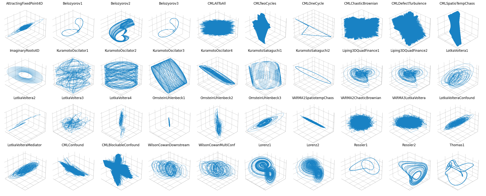
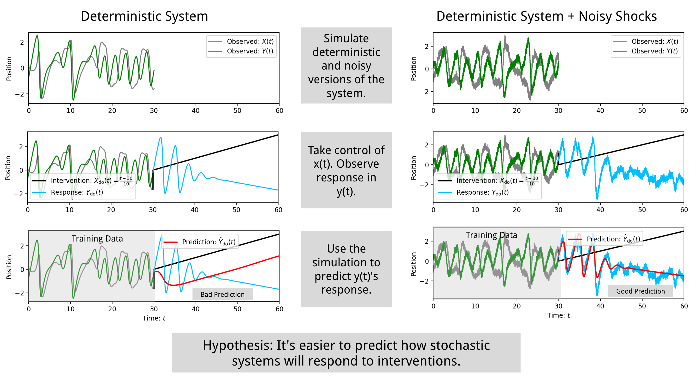

# Summary
The vision of Interfere is simple: What if we used high quality scientific models to benchmark our causal prediction tools? When attempting to infer causal relationships from data, randomized experimental data and counterfactuals are key, but obtaining such datasets is expensive and difficult. Across many fields, like economics, neuroscience, ecology, systems biology and others, mechanistic models are developed to simulate scenarios and predict the response of systems to interventions [@brayton_frbus_2014], [@izhikevich_large-scale_2008], [@banks_parameter_2017], [@baker_mechanistic_2018]. Because these models are painstaking calibrated with the real world, they have the ability to generate synthetic counterfactual data containing complexity characteristics of the real processes they emulate. With this vision in mind, Interfere offers the first steps towards such a vision: (1) A general interface for simulating the effect of interventions on dynamic simulation models, (2) a suite of predictive methods and cross validation tools, and (3) an initial benchmark set of dynamic counterfactual scenarios. 

# Statement of need
Over the past twenty years we've seen an emergence of multiple frameworks for identifying causal relationships [@imbens_causal_2015], [@pearl_causality_2009], [@wieczorek_information_2019]. The most influential frameworks are probabilistic and while is not a requirement of the frameworks, typically in practice, a linear relationship is assumed [@runge_discovering_2022]. However, when attempting to anticipate the response of complex systems in the medium and long term, linear models are insufficient. (For example, static linear models cannot predict scenarios where things get worse before they get better.) Thus, there is a need for causal models with more complexity. Currently, there are very few techniques that are able to fit causal dynamic non-linear models to data. Because of this, we see an opportunity to bring together both the insights from recent breakthroughs in causal inference and the descriptive power of mechanistic modeling.  In order to facilitate this cross pollination, we identified a key causal problem: predicting how a complex system responds to a previously unobserved intervention, and designed the Interfere package as a focal point for building and benchmarking tools aimed at intervention response prediction. The dynamic models contained in interfere present challenges for causal inference that can likely only be addressed with the incorporation of mechanistic assumptions. As such, the interfere package creates a much needed link between the causal inference community and mechanistic modeling community.



# Usage

The Interfere package is designed around three tasks: Counterfactual simulation, predictive method optimization and prediction. An example of counterfactual simulation can be summarized in the following code:
```python
import numpy as np
import interfere
import optuna

initial_cond = np.random.rand(3)
t_train = np.arange(0, 10, 0.05)
dynamic_model = interfere.dynamics.Belozyorov3DQuad()

# Observation Period.
Y = dynamic_model.simulate(t_train, initial_cond)

# Forecasting period.
t_test = np.arange(t_train[-1], 12, 0.05)

# Treatment
interv = interfere.SignalIntervention(np.sin, 1)
Y_treat = dynamic_model.simulate(t_test, Y, intervention=interv)

# Counterfactual
Y_cntr = dynamic_model.simulate(t_test, initial_cond)
```

Using the data above, we can fit a method to the observation period and attempt to predict both the intervention response and the counterfactual.

```python
cv_objv = interfere.CrossValObjective(
        method_type=interfere.SINDY,
        data=Y,
        times=t_train,
        train_window_percent=0.3,
        num_folds=5,
        exog_idxs=interv.intervened_idxs,
)
study = optuna.create_study(name="Interfere Demo Study")
study.optimize(cv_objv, ntrials=10)

params = study.best_params
sindy = interfere.SINDY(**params)
sindy.fit(t_train, interv.split_exog(Y))

```

# Primary Contributions

The Interfere package provide three primary contributions to the scientific community.

## 1. Dynamically Diverse Counterfactuals at Scale

The "dynamics" submodule in the interfere package contains over fifty dynamic models. It contains a mix of linear, nonlinear, chaotic, continuous time, discrete time, stochastic, and deterministic models. The models come from a variety of diciplines including economics, finance, ecology, biology, neuroscience and public health. Each model inherits the from the Interfere BaseDynamics type and gains the ability to take exogenous control of any observed state and to add measurement noise. Most models also gain the ability to make any observed state stochastic where magnitude of stochasticity can be controlled by a simple scalar parameter or fine tuned with a covariance matrix.

Because of the difficulty of building models of complex systems, predictive methods for complex dynamics are typically benchmarked on less than ten dynamical systems [@challu_nhits_2023], [@brunton_discovering_2016], [@vlachas_backpropagation_2020], [@pathak_model-free_2018], [@prasse_predicting_2022]. As such, Interfere offers a clear improvement over current benchmarking methods for prediction in complex dynamics.

Most importantly, Interfere is built around interventions—the ability to manipulate the state of a complex system and observe the response. This is no simple feat for complex scientific models that are implemented with a variety of simulation packages. Thus Interfere offers the ability to produce multiple complex dynamic *counterfactual scenarios* at scale. This unqiue feature enables large scale evaluation of dynamic causal prediction methods—tested against systems with properties of interest to scientists.

## 2. Cross Disciplinary Forecast Methods

A second contribution of interfere is the integration of dynamic forecasting methodologies from deep learning, applied mathematics and social science. The Interere "ForecastingMethod" class is expressive enough to describe, fit and predict with multivariate dynamic models and intervene on the states of the models during prediction. This cross diciplinary mix of techniques affords new insights into the problem of intervention response prediction.

## 3. Opening Up Intervention Response to the Scientific Community

The third major contribution of Interfere is that it poses the intervention response problem—a highly applicable question, to the broader community. The Interfere Benchmark 1.0.0 has the potential provide simple comprehensive evaluation of computational methods on the intervention response problem and therefore streamline future progress towards correctly anticipating how complex systems will respond to new scenarios.


# Related Software and Mathematical Foundations

## Predictive Methods
The Interfere package draws extensively on the Nixtla open source ecosystem for time series forecasting. Nixtla's NeuralForecast proves three of the methods that are integrated with Interfere's interface and StatsForecast provides one of the methods [@olivares2022library_neuralforecast], [@garza2022statsforecast]. Nixtla also provided the inspiration for the cross validation and hyperparameter optimization workflow. Interfere also integrates with predictive methods from the PySINDy and StatsModels packages [@kaptanoglu2022], [@seabold2010statsmodels]. An additional reservoir computing method for global forecasts comes from [@harding_global_2024]. Hyperparameter optimization is designed around the Optuna framework [@akiba2019optuna].

## Dynamic Models

See the table below for a full list of dynamic models with attributions that are currently implemented in the interfere package. The dynamic models in were implemented directly from mathematical descriptions except for two which adapt existing simulations from the PyClustering package [@novikov2019].

| Dynamic Model Class                 | Short Description                                                           | Source                                                                                                       | Properties                            |
|-------------------------------------|-----------------------------------------------------------------------------|--------------------------------------------------------------------------------------------------------------|---------------------------------------|
| ArithmeticBrownianMotion            | Brownian motion with linear drift and constant diffusion                    | [@oksendal_stochastic_2005] | Stochastic, Linear                    |
| Coupled Logistic Map                | Discrete-time logistic map with spatial coupling                            | [@lloyd_coupled_1995] | Non-linear, Chaotic                   |
| StochasticCoupledMapLattice         | Coupled map lattice with stochastic noise                                   | [@kaneko_coupled_1991] | Non-linear, Stochastic, Chaotic       |
| MichaelisMenten                     | Model for enzyme kinetics and biochemical reaction networks                 | [@srinivasan_guide_2022] | Non-linear, Stochastic                |
| LotkaVolteraSDE                     | Stochastic Lotka-Volterra predator-prey model                    | [@hening_stochastic_2018] | Non-linear, Stochastic                |
| Kuramoto                            | Coupled oscillator model to study synchronization                           | [@rodrigues_kuramoto_2016]                                                     | Non-linear, Stochastic                |
| KuramotoSakaguchi                   | Kuramoto model variant with phase frustration                               | [@sakaguchi_soluble_1986]  | Non-linear, Stochastic                |
| HodgkinHuxleyPyclustering           | Neuron action-potential dynamics based on Hodgkin-Huxley equations          |[@hodgkin_quantitative_1952] | Non-linear                            |
| StuartLandauKuramoto                | Coupled oscillators with amplitude-phase dynamics                           | [@cliff_unifying_2023]| Non-linear, Stochastic                |
| MutualisticPopulation               | Dynamics of interacting mutualistic species                                 | [@prasse_predicting_2022]                       | Non-linear                            |
| OrnsteinUhlenbeck                   | Mean-reverting stochastic differential equation                             |[@gardiner_stochastic_2009] | Stochastic, Linear                    |
| Belozyorov3DQuad                    | 3-dimensional quadratic chaotic system                                      | [@belozyorov_exponential_2015]| Non-linear, Chaotic                   |
| Liping3DQuadFinance                 | Chaotic dynamics applied in financial modeling                              | [@liping_new_2021] | Non-linear, Chaotic                   |
| Lorenz                              | Classic chaotic system describing atmospheric convection                    | [@lorenz_deterministic_2017] | Non-linear, Chaotic                   |
| Rossler                             | Simplified 3D chaotic attractor system                                      | [@rossler_equation_1976] | Non-linear, Chaotic                   |
| Thomas                              | Chaotic attractor with simple structure and rich dynamics                   | [@thomas_deterministic_1999]               | Non-linear, Chaotic                   |
| DampedOscillator                    | Harmonic oscillator with damping and noise                                  | (Classical linear model) | Linear, Stochastic                    |
| SIS                                 | Epidemiological model (Susceptible-Infected-Susceptible)                    |[@prasse_predicting_2022] | Non-linear, Stochastic                |
| VARMADynamics                       | Vector AutoRegressive Moving Average for time series modeling               | [@hamilton_time_2020]                                          | Linear, Stochastic                    |
| WilsonCowan                         | Neural mass model for neuronal population dynamics                          | [@wilson_excitatory_1972]  | Non-linear                            |
| GeometricBrownianMotion             | Stochastic model widely used in financial mathematics                       | [@black_pricing_1973]               | Non-linear, Stochastic                |
| PlantedTankNitrogenCycle            | Biochemical cycle modeling nitrogen transformation in aquatic systems       | [@fazio_mathematical_2006] | Non-linear                            |
| GenerativeForecaster                | Predictive forecasting models trained on simulation, then used to generate data                    | (Written for Interfere)               | Stochastic                |
| StandardNormalNoise                 | IID noise from standard normal distribution                                 | [@cliff_unifying_2023]                                                              | Stochastic                            |
| StandardCauchyNoise                 | IID noise from standard Cauchy distribution                                 | [@cliff_unifying_2023]                                                                | Stochastic                            |
| StandardExponentialNoise            | IID noise from standard exponential distribution                            | [@cliff_unifying_2023]                                                                   | Stochastic                            |
| StandardGammaNoise                  | IID noise from standard gamma distribution                                  |[@cliff_unifying_2023]                                                                     | Stochastic                            |
| StandardTNoise                      | IID noise from Student’s t-distribution                                     | [@cliff_unifying_2023]                                                                     | Stochastic                            |


# Acknowledgements
This work was supported by NSF GRFP.

# References